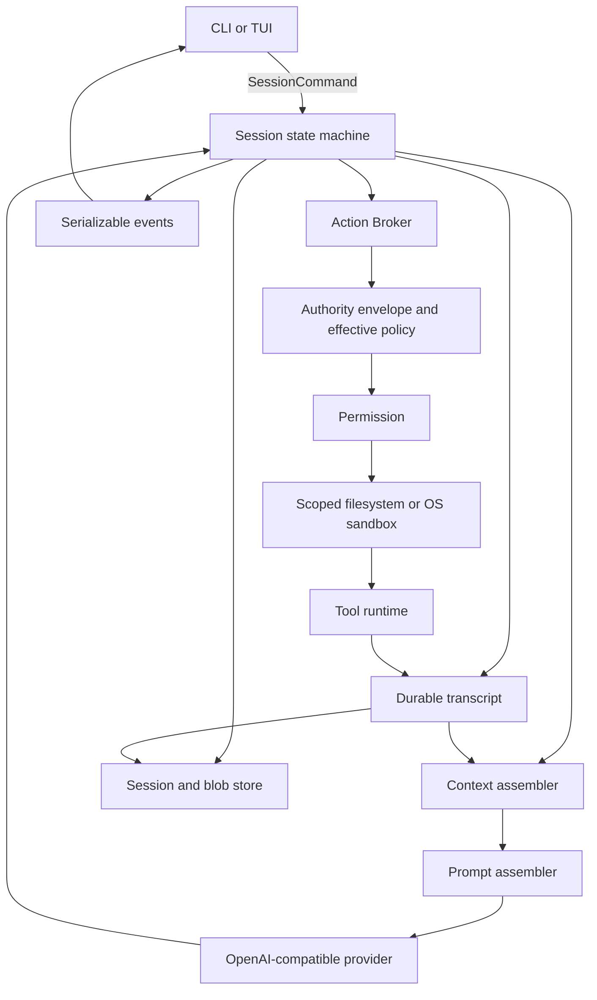
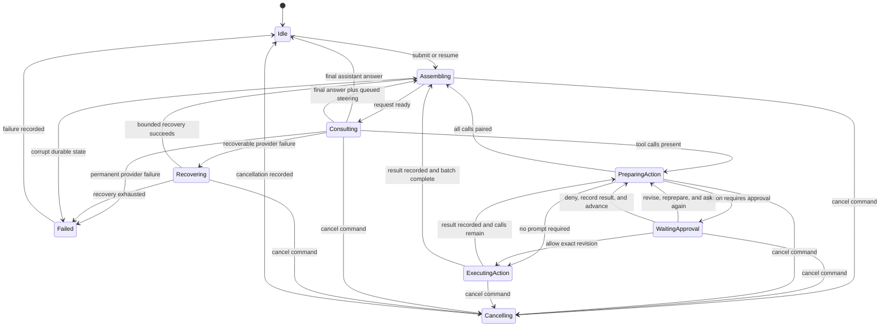

# Coragent V2 架构

本文档定义 V2 的运行时边界、数据流、状态转换和安全不变量。它不冻结公开的 Go API。
到 M5 之前，所有实现包都保持 internal。

请先阅读 `product.md`。产品行为和基准证据优先于这里提出的任何包形状。

## 架构定位

Coragent 是模型外层的运行时。模型决定说什么、请求哪些工具。Coragent 拥有持久会话、
模型上下文、工具执行、权限、恢复和用户交互。

核心循环保持精简：

```text
组装模型请求
调用模型提供商
记录助手输出
通过 Action Broker 执行每个被请求的工具
为每个工具调用记录一个结果
只要还有工具调用就重复
```

生产行为属于这个循环周边的协作者。循环本身不解析设置、不直接访问文件系统、不渲染
终端、不实现提供商重试，也不判断某个动作是否安全。

## 系统视图



依赖向内指。前端、提供商适配器、文件系统适配器和平台沙箱代码依赖运行时契约。运行时
包不导入前端或提供商传输格式。

## 核心概念

### 引擎（Engine）

引擎创建、加载、列出和关闭会话。它拥有进程级配置和适配器。它不拥有跨会话共享的
对话。

引擎在 M5 之前保持 internal。产品必须先证明嵌入方需要哪些操作，这些操作才能公开。

### 会话（Session）

一个会话是"一个工作区 + 一份持久用户交互历史"。它拥有：

- 会话记录
- 当前运行状态
- 不可变授权信封和数据投影配置
- 持久运行预算计数器
- 待处理的会话命令
- 上下文检查点
- 审批请求
- 任务台账状态
- 对已存储工具输出的引用

每个会话同时只有一个活跃运行。已保存的会话可以在新进程中恢复。

### 会话命令（SessionCommand）

会话命令请求会话改变状态。V2 累积协议覆盖：

- 提交用户提示
- 应答审批请求
- 确认不确定动作
- 排队引导
- 取消当前工作
- 恢复已保存的会话
- 关闭会话

M1 实现提交、取消、恢复和关闭。M2 增加审批响应和不确定动作确认。M4 增加排队引导。
更早的里程碑不会在其行为契约存在之前暴露某个命令。

每个会话命令都有 ID。应答某个请求的会话命令还携带该请求的 ID。重复应答会被拒绝，
且不改变状态。会话命令属于控制面输入，区别于作为预备进程动作的 shell 命令。

### 事件（Event）

事件报告已经发生的事实。事件使用一个可序列化信封，包含会话 ID、运行 ID、会话级游标、
时间戳、种类和种类专属的载荷。游标跨运行递增，其高水位标记是持久的。

事件不包含回复通道、回调、带私有内部结构的错误或仅限 Go 的值。前端通过发送新的会话
命令来应答审批请求之类的事件。

事件是观察边界，不是模型上下文的权威来源。会话记录提供持久的对话真相。

前端通过一次原子观察操作重连。引擎在持有会话观察锁的同时注册订阅者，捕获一份会话
记录投影、当前部分助手缓冲、活跃工具状态、待处理交互和游标，然后释放游标大于快照
游标的事件。前端按游标去重。它绝不做"快照 + 订阅"分离的两步操作，那会丢失审批或
终止事件。

### 会话记录（Transcript）

会话记录是语义上有意义的会话历史的只追加记录。它记录：

- 用户消息
- 已完成的助手内容块
- 提议的工具调用
- 预备动作引用和预览
- 权限请求和决定
- 每个工具调用的一个结果
- 上下文检查点引用
- 引导和取消边界
- 运行终止结果

流式文本增量可以实时发出，而不必每个 token 都成为一条持久记录。完整的助手块是持久
的。这样回放依然有用，又不会把存储变成 UI 动画日志。

会话记录绝不被压缩改写。纠正通过追加一条新记录来完成，该记录取代先前的解释。

### 模型上下文

模型上下文是为一次提供商请求构建的有界投影。它结合稳定策略、项目指令、上下文检查点、
选定的会话记录、可用工具和当前任务状态。

上下文组装器可以省略或摘要旧材料。它必须保留足够的溯源，让人看出摘要覆盖了哪段
会话记录。它绝不删除源记录。

### 数据分类与投影

Coragent 在数据跨越会话记录、模型上下文、事件、日志或 blob 存储边界之前对其分类：

- `normal`（普通）：普通用户文本和工作区内容
- `sensitive`（敏感）：受保护路径的内容，以及被版本化高置信度凭据检测器匹配的值
- `runtime_secret`（运行时密钥）：提供商密钥、已配置凭据和 Coragent 拥有的私有能力材料

运行时密钥通过专用凭据源进入适配器。它们绝不成为工具参数、进程环境变量、会话记录、
模型内容、事件、日志或基准产物。

已知的敏感工作区路径——包括存活的配置文件、私钥和凭据存储——对进程沙箱一律拒绝，
文件工具只返回脱敏后的结构化视图。其他工作区内容中的高置信度凭据匹配在任何投影或
持久化之前完成脱敏。原始敏感工具缓冲区只存在于分类期间，绝不写入 blob 存储。

| 类别 | 会话记录 | 模型上下文 | 事件或前端快照 |
| --- | --- | --- | --- |
| `normal` | 有界的语义内容 | 选定的有界内容 | 展示投影 |
| `sensitive` | 路径、摘要、脱敏元数据和脱敏内容 | 仅脱敏内容 | 路径和脱敏提示，外加安全的结构化内容 |
| `runtime_secret` | 永不 | 永不 | 永不 |

用户提交即授权把普通提示文本发送给所配置的提供商。高置信度凭据匹配在持久化或提交给
提供商之前被替换为标记，前端收到不含匹配值的警告。初始 V2 没有"发送已检测凭据"的
覆盖开关；用户必须重新提交净化后的文本。

流式助手输出在发出事件前经过增量脱敏器。包含已检测凭据材料的预备变更，在其内容成为
预览之前就被阻止。日志包含标识符、分类、大小和摘要，但不包含用户或工具内容。

对任意未标记数据，密钥检测必然不完整。Coragent 保证处理运行时自有、受保护路径和已
检测到的密钥材料。它不声称启发式规则能识别用户可能视为机密的每一个值。

### 提供商（Provider）

提供商适配器在内部模型请求和一种 OpenAI 兼容流式协议之间转换。它报告：

- 文本增量
- 完整工具调用
- 端点提供时的用量
- 终止的提供商原因
- 分类后的失败

提供商暴露或接收显式的上下文窗口上限。Coragent 不从模型名称后缀推导容量。

完成响应中的工具调用决定循环是否进入工具阶段。终止原因对恢复和诊断仍有用，但流式
结束字段不是唯一的继续信号。

### 工具与预备动作（Tool / Prepared Action）

工具声明它面向模型的名称、用途、参数模式和执行行为。工具不自行决定自己的生效权限。

在动作可以请求权限或产生副作用之前，工具先创建一个预备动作。准备过程可取消且无
副作用。预备值包含：

- 校验后的有效参数
- 声明的效果，如读、写、进程或网络
- 受影响的路径
- 有界的用户可见预览
- 需要时的过期状态检测身份令牌

读操作可以使用轻量预备值。变更使用绑定身份的预备值，确保用户审批的动作就是实际提交
的动作。

### Action Broker

Action Broker 是唯一的工具执行入口。它解析工具、准备动作、强制权限、执行、限制结果
大小，并返回一个工具结果。

没有任何工具能拿到不受限制的文件系统或进程启动器。文件工具使用限定工作区的文件系统
服务。命令工具使用沙箱进程运行器。

### 策略、权限与沙箱

这几层回答不同的问题：

- 授权信封是会话的不可变最大能力。它由硬产品策略和显式启动配置创建。
- 生效策略决定信封中哪一部分有资格用于当前预备动作。它不能增加权限。
- 权限决定该资格权限现在是否可被激活、是否必须由用户审批、或者该动作是否被拒绝。
- 限定作用域的文件系统和 OS 沙箱在执行期间强制已批准的限制。

权限不能扩大授权信封。未来的钩子或插件也不能扩大它。按调用授权的 grant 激活的是信封
中已经存在的子集，只适用于那个精确的预备动作版本，并随该动作一起过期。扩大信封需要
显式配置和一个新会话，而不是一次审批响应。

提供商传输是独立的控制面能力。只有提供商适配器能连接会话配置中固定的端点，且使用
专用凭据源。这种连接性绝不继承给工具或进程动作，也不计入工具网络授权。

初始 GA 只在 macOS 上支持进程动作，那里命令执行使用 OS 强制沙箱。在没有等效后端的
平台上，命令工具在准备或审批之前就不可用。Coragent 绝不回退到不受限制的执行，也
绝不把字符串检查说成沙箱。

进程运行器构建最小化环境，而不是转发主机环境。它只提供配置过的可执行文件搜索路径、
locale 值、会话持有的临时目录，以及由预备动作声明且被授权信封允许的变量。凭据变量和
环境中的开发者密钥默认缺失。后端要求的系统读取和可执行路径是显式平台能力，不是不可见
的环境访问。

### 会话与 blob 存储

V2 用户数据放在 `~/.coragent/v2/`。项目本地设置放在 `.coragent/v2/`。

会话存储持久化授权信封、数据投影版本、会话记录、动作尝试记录、预算计数器、观察游标
和检查点；共享同一状态转换的部分以原子方式持久化。大型工具结果存放在会话拥有的、
按内容或身份寻址的 blob 区域。会话记录保存有界预览和持久引用。

V2 不修改 V1 数据。测试把每个持久存储替换为临时目录。

## 会话状态机



这个图描述运行时状态，不是 UI 界面。状态事件报告这些转换，而状态机仍是权威。

### 安全边界

安全边界存在于：提供商响应关闭之后、每个工具结果记录之后、下一次提供商请求之前。

活跃工作期间提交的引导会被排队。引擎在下一个安全边界应用它。如果一个响应提出了多个
工具调用、而引导停止了剩余调用，引擎在追加引导消息之前，为每个未执行的调用记录一条
合成跳过结果。工具调用配对仍然有效。

修改审批响应会使旧的预备动作和审批失效。工具调用回到模式校验、准备、授权信封与生效
策略检查、预览，以及带有新版本 ID 的新审批请求。只有指名那个新版本的审批才能进入
执行。

取消不同于引导。它立即传播到提供商、工具、沙箱运行器和进程组。引擎仍为任何无法执行
的提议调用记录一条已取消结果。

## 提示词与指令组装

提示词组装器从运行时状态构建各区块。它不会在整个会话中向一个全局字符串追加文本。

稳定区块包括代理身份、操作规则、工具使用规则和安全策略。动态区块包括工作区事实、
项目指令、工具目录、任务台账、上下文检查点和每次运行的指导。

稳定与动态区块保持分离，这样适配器可以使用提供商的提示词缓存，而不会掩盖动态状态。

### 指令发现

M1 从仓库根目录经由当前工作目录发现 `CLAUDE.md` 和 `AGENTS.md`。

指令优先级从低到高为：

1. 用户级偏好
2. 仓库根目录指令
3. 适用于当前路径的更深目录中的指令
4. 当前明确的用户请求
5. 硬运行时策略

在同一个目录内，`CLAUDE.md` 先于 `AGENTS.md` 加载，因此当两个文件在同一作用域冲突时，
`AGENTS.md` 胜出。相同文档按内容哈希去重。加载的源及其作用域记录在会话记录中。

当前用户请求不能覆盖硬安全策略。当其他指令冲突时，组装器保留源标签，让模型和用户
能看到是哪条指令获胜。

## 上下文策略

上下文工作遵循固定顺序。廉价的确定性操作先于摘要模型调用执行。

1. 为每个新工具结果限界。过大的内容在替换为预览和引用之前先持久化。
2. 移除冗余的旧模型可见记录，同时保留工具调用与工具结果的对。
3. 把较旧的庞大工具结果替换为可重新加载的引用。
4. 当现有检查点已覆盖所需会话记录范围时，复用它。
5. 当请求仍超过主动阈值时，创建新的摘要检查点。
6. 如果提供商拒绝该提示为过长，再做一次更激进的响应式压缩并重试一次。

模型请求始终保留：

- 授权信封、生效策略和当前项目指令
- 当前用户目标和明确约束
- 未解决的工具调用和结果
- 当前任务台账状态
- 预算内的近期文件和补丁上下文
- 最新的用户与助手交换
- 重新加载已持久化输出所需的引用

摘要检查点标明它们覆盖的会话记录序列范围。关键约束和任务状态既存在于结构化字段，
也存在于叙述性文字中，这样摘要的遗漏不会静默删掉它们。

## Action Broker 流水线

每个工具调用都遵循这一顺序：

```text
解析工具
校验模式
在无副作用的前提下准备有效动作
对动作内容分类并阻止已检测的凭据材料
推导效果、路径、身份和预览
应用授权信封与生效策略
应用内部执行前检查
解析权限
持久化一个已开始的动作尝试
提交前立即验证预备身份
通过限定作用域的能力或 OS 沙箱执行
应用执行后检查
分类并构建脱敏的会话记录、模型和展示投影
持久化或限界大型输出
原子地完成动作尝试并追加恰好一个工具结果
```

如果执行前检查修改了参数，Broker 会重新校验并准备动作。先前的预览或审批不适用于修改
后的参数。用户修改参数时走同样的完整循环。一次修改总是产生新预览和新的审批请求。

执行后检查可以在数据投影器构建脱敏的会话记录、模型和展示形式之前注解一个结果。它不能
声称已发生的副作用被回滚了。副作用之后的失败会如实记录部分结果。

### 动作日志与崩溃对账

操作系统无法把外部副作用与会话记录写入原子地合并。因此 Coragent 显式呈现不确定性，
而不是静默重放工作。

执行前一刻，Broker 持久化一条动作尝试记录，包含唯一尝试 ID、工具调用 ID、预备动作
摘要、效果声明、执行前身份和 `started` 状态。执行后，存储在一个事务中写入终止的
动作尝试状态及其工具结果。

恢复时，在任何新模型请求之前，先对没有终止记录的 `started` 尝试做对账：

- 读动作变为 `interrupted`，模型可以再次请求
- 确定性文件变更比较前状态和预期后状态身份；后状态完全吻合变成 `recovered_success`，
  前状态未变变成 `interrupted_no_effect`，其他任何状态变成 `indeterminate`
- 进程动作变成 `indeterminate`，除非执行器专属回执能证明其结果

Coragent 绝不自动重做一次被中断的变更或进程动作。每个对账后的状态都成为与未关闭调用
配对的那一个工具结果。不确定副作用展示给用户，并要求确认后才能继续运行。

macOS 进程运行器使用一个小型监管进程，它拥有子进程组和来自 Coragent 的控制通道。
如果该通道因主进程退出而关闭，监管进程终止整个进程组。启动对账还会检查记录的进程组
回执，并在把动作尝试报告为 `indeterminate` 之前终止任何幸存进程。

### 初始权限策略

M1 只暴露限定工作区的 list、read 和 search 工具。模型不能请求变更或命令执行。M1
实现直接使用限定作用域的文件系统，不启动辅助进程。

M2 增加这一策略：

- 工作区读取无需审批
- 工作区变更需要审批预备补丁
- 进程动作需要审批预备命令、环境和声明的能力
- 默认授权信封包含工作区、会话持有的临时存储，以及后端要求的系统读取和可执行路径
- 工作区外写入和网络访问不在默认授权信封中
- 可选外部根目录或网络端点必须在会话启动时配置；狭窄的按调用 grant 只能激活该项
  已配置权限
- grant 在该预备动作完成时过期
- 平台无法强制信封时，进程动作不可用

持久化白名单和替代权限模式仍超出范围。

## 提供商与运行时恢复

失败在重试前先分类：

| 失败 | 初始行为 | 上限 |
| --- | --- | --- |
| 速率限制、瞬时传输错误或提供商过载 | 带抖动的指数退避；尊重 `Retry-After` | 初次请求后最多八次重试 |
| 提示过长 | 响应式压缩，然后重发请求 | 一次响应式尝试 |
| 输出长度超限 | 把配置的输出预算提高一次，然后使用有界续写 | 一次升级和三次续写 |
| 认证或无效请求 | 以永久提供商错误停止 | 不重试 |
| 取消 | 传播取消并记录已取消结果 | 不重试 |
| 畸形提供商流 | 以协议错误停止 | 不重试 |

初始重试计划从 500 毫秒开始，每次失败翻倍，计算出的延迟封顶 30 秒，并施加 20% 抖动。
服务器提供的 `Retry-After` 取代计算延迟，但封顶 120 秒。取消会中断每次等待。

恢复状态属于持久运行预算。重试不会追加部分助手输出，除非所选恢复方式显式把该输出
用作续写前缀。

当重叠移除不再带来新字节时，重复续写提前停止。恢复路径绝不会在不消耗计数器的情况下
自我调用。

每次运行都在消耗工作之前持久化其预算。初始默认值：

- 64 次逻辑模型调用，包括正常轮次、压缩调用和续写
- 96 次提供商传输尝试，包括重试
- 累计 10 分钟重试延迟
- 128 个提议工具调用
- 累计 60 分钟活跃提供商与工具时间，不含等待人工审批的时间
- 估计 400 万输入令牌和 51.2 万输出令牌

第一个被耗尽的边界停止新工作，因此按请求的重试上限不能覆盖累计提供商尝试或重试延迟
上限。

上下文组装器在请求前预留估计令牌，并在可用时与提供商用量对账。配置的金额上限同样是
硬性的；在没有可信定价数据时，Coragent 报告"未强制执行金额上限"，而不是猜测成本。

预算计数器、重试计数器和预留用量在进程重启后仍然存在。崩溃不能重置它们。达到任何
边界都会记录一个可恢复的暂停结果，而不是静默开始更多工作。用户可以在保留同一会话和
会话记录的前提下，显式地以全新运行预算继续。

## 工具调用配对

提供商协议要求每个工具调用都有一个结果。Coragent 把这一点作为会话记录不变量来强制：

- 成功执行记录成功结果
- 工具错误记录错误结果
- 权限拒绝记录已拒绝结果
- 策略阻止记录已阻止结果
- 过期状态检测记录已过期结果
- 取消记录已取消结果
- 引导为剩余调用记录跳过结果
- 更早的非成功结果让剩余调用记录先前结果跳过结果
- 未知工具记录未知工具结果
- 崩溃对账记录已恢复、已中断或不确定结果

工具调用按提供商顺序执行。批次在成功或恢复成功后继续。第一个非成功结果停止批次执行；
剩余每个调用收到合成的先前结果跳过结果。下一个模型请求看到完整批次，并决定如何恢复。

不可恢复的引擎失败可能停止执行，但在会话记录被用于另一次模型请求之前，恢复或续跑
必须用明确的已中断结果修复任何未关闭调用。

## 前端边界

行式 CLI 和后来的 TUI 使用同一个运行时表面：

- 发送会话命令
- 消费事件
- 在一个事件游标处原子地观察会话记录和待处理状态快照

前端可以格式化差异、权限请求、任务状态或错误。它不分类动作、不代用户审批、不压缩
上下文，也不从缺失事件推断运行完成。

TUI 在 M4 出现。它的第一个版本包括会话记录、工具状态、补丁预览、审批提示、任务状态、
上下文状态、会话选择、引导和取消。主题、鼠标工作流、动画和高级检查器仍在 V2 发布
边界之外。

## 并发

到 M4 为止：

- 每个会话同时只有一个活跃运行
- 工具调用按提供商顺序执行
- 不同已保存会话不共享可变运行时状态
- 取消和审批使用关联 ID 和幂等的会话命令处理

后台工具、可并行的批次、子代理和常驻队友是各自独立的设计。它们不通过隐藏 goroutine
进入运行时。

## 计划的源码布局

实现可以细化名称，但必须保留这些依赖方向：

```text
cmd/coragent/              行式产品入口
internal/engine/           会话命令循环和运行状态机
internal/transcript/       持久记录、配对和投影
internal/context/          请求选择与压缩
internal/prompt/           指令发现与提示词区块
internal/dataproj/         分类与脱敏投影
internal/credential/       运行时密钥源
internal/provider/openai/  OpenAI 兼容传输适配器
internal/action/           工具目录、准备与 Action Broker
internal/policy/           硬权限与权限决定
internal/sandbox/          平台进程隔离
internal/tools/            工作区读取、搜索、补丁和命令工具
internal/store/            会话、检查点和大型输出 blob
internal/event/            可序列化观察信封
internal/sessioncommand/   可序列化控制消息
tui/                       M4 前端
pkg/coragent/              仅在 M5 创建
```

在 M5 SDK 设计获批之前，不要添加 `pkg/coragent/`。

## 测试接缝

每个主要边界都有一个离线替身：

- 脚本化提供商发出文本、工具调用、用量和分类失败
- 内存或临时会话记录存储支持崩溃与回放测试
- 假 Action Broker 记录准备和执行，不产生副作用
- 假权限响应器发送带关联的会话命令
- 假时钟驱动重试和超时行为
- 假沙箱运行器记录进程和 grant 请求

测试必须覆盖快乐路径、永久失败、有界恢复、取消、重复会话命令、过期预备动作、通过
`..` 和符号链接逃出工作区、畸形持久记录、上下文压缩和进程清理。

崩溃测试在每次动作尝试日志写入、副作用、结果事务、预算预留和游标检查点前后停止进程。
观察测试让快照创建与审批、工具结果和终止事件并发竞争，并证明游标既不产生缺口也不
产生重复状态。

`benchmarks.md` 中的真实模型基准度量产品行为。单元测试不能替代它，基准分数也不能
替代运行时不变量。

## 不可协商的不变量

1. 会话记录只追加，且扛得住上下文压缩。
2. 在下一次模型请求之前，每个工具调用恰好有一个终止结果。
3. 每个副作用都经过同一个 Action Broker。
4. 任何审批或扩展都不能超过会话授权信封。
5. 文件和命令工具收到限定作用域的能力，而非环境权限。
6. 事件是可序列化的事实；会话命令携带控制意图。
7. 事件游标在整个会话中单调递增。
8. 取消能到达每个活跃阻塞操作。
9. 过期的预备变更不能提交。
10. 提供商特有的传输数据不逃出它的适配器。
11. 前端不拥有会话状态。
12. 公开 API 设计等待 M5 基准证据。
13. 已开始的动作尝试会被对账，绝不自动重放。
14. 运行预算计数器在重启后仍然存在，每个恢复路径都会消耗它们。
