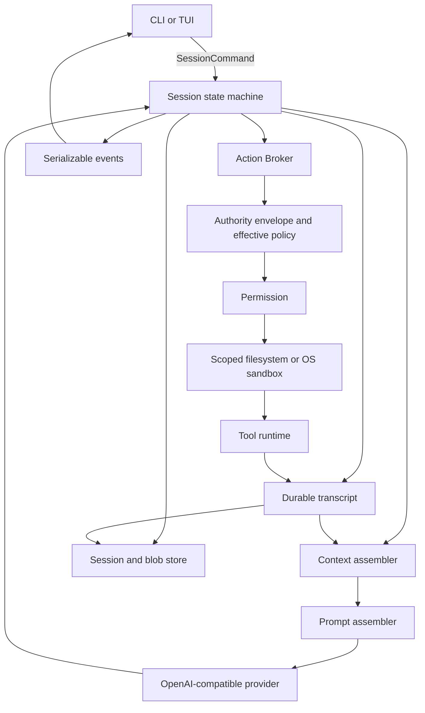
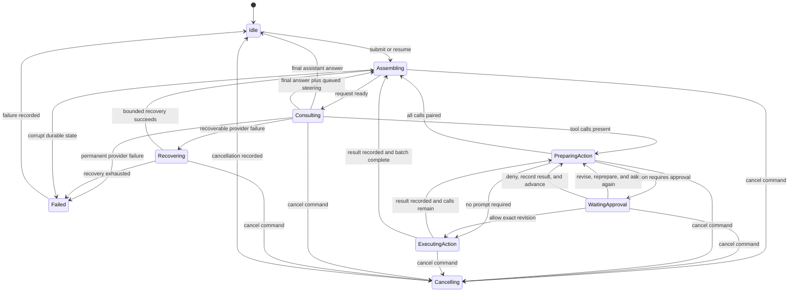

# Coragent V2 Architecture

This document defines the V2 runtime boundaries, data flow, state transitions,
and safety invariants. It does not freeze a public Go API. All implementation
packages remain internal until M5.

Read `product.md` first. Product behavior and benchmark evidence take precedence
over a package shape proposed here.

## Architectural position

Coragent is a runtime around a model. The model chooses what to say and which
tools to request. Coragent owns the durable session, model context, tool
execution, authority, recovery, and user interaction.

The central loop stays small:

```text
assemble model request
call the provider
record assistant output
execute every requested tool through the Action Broker
record one result per tool call
repeat while tool calls are present
```

Production behavior belongs in collaborators around this loop. The loop does not
parse settings, access the filesystem directly, render a terminal, implement
provider retries, or decide whether an action is safe.

## System view



Dependencies point inward. Frontends, provider adapters, filesystem adapters,
and platform sandbox code depend on runtime contracts. Runtime packages do not
import a frontend or a provider wire format.

## Core concepts

### Engine

The Engine creates, loads, lists, and closes sessions. It owns process-wide
configuration and adapters. It does not own a conversation shared by all
sessions.

The Engine is internal until M5. The product must prove which operations an
embedder needs before those operations become public.

### Session

A Session is one durable user interaction history for one workspace. It owns:

- the transcript
- the current run state
- the immutable Authority Envelope and data-projection configuration
- durable Run Budget counters
- pending SessionCommands
- context checkpoints
- approval requests
- task ledger state
- references to stored tool output

One run is active per session. A saved session can be resumed in a new process.

### SessionCommand

A SessionCommand asks a session to change state. The cumulative V2 protocol
covers:

- submit a user prompt
- answer an approval request
- acknowledge an indeterminate action
- queue steering
- cancel active work
- resume a saved session
- close a session

M1 implements submit, cancel, resume, and close. M2 adds approval responses and
indeterminate-action acknowledgement. M4 adds queued steering. An earlier
milestone does not expose a command before its behavioral contract exists.

Every SessionCommand has an ID. SessionCommands that answer a request also carry
the request ID. Duplicate answers are rejected without changing state. A
SessionCommand is control-plane input and is distinct from a shell command,
which is a prepared process action.

### Event

An Event reports a fact that already occurred. Events use one serializable
envelope containing a session ID, run ID, session-wide cursor, timestamp, kind,
and kind-specific payload. Cursors increase across runs and their high-water mark
is durable.

Events do not contain reply channels, callbacks, errors with private internals,
or Go-only values. A frontend sends a new SessionCommand to answer an event such
as an approval request.

Events are an observation boundary, not the authority for model context. The
transcript supplies durable conversational truth.

Frontends reconnect through one atomic observe operation. The engine registers
the subscriber while holding the session observation lock, captures a transcript
projection, current partial assistant buffer, active tool state, pending
interactions, and cursor, and then releases events whose cursor is greater than
the snapshot cursor. A frontend deduplicates by cursor. It never performs a
separate snapshot and subscribe sequence that could lose an approval or terminal
event.

### Transcript

The Transcript is the append-only record of semantically meaningful session
history. It records:

- user messages
- completed assistant content blocks
- proposed tool calls
- prepared action references and previews
- permission requests and decisions
- one result for each tool call
- context checkpoint references
- steering and cancellation boundaries
- terminal run outcomes

Streaming text deltas may be emitted live without becoming one durable record per
token. The completed assistant block is durable. This keeps replay useful without
turning storage into a UI animation log.

Transcript records are never edited by compaction. Corrections append a new
record that supersedes an earlier interpretation.

### Model context

Model context is a bounded projection built for one provider request. It combines
stable policy, project instructions, a context checkpoint, selected transcript
records, available tools, and current task state.

The Context Assembler may omit or summarize old material. It must retain enough
provenance to show which transcript range produced a summary. It never deletes
the source records.

### Data classification and projections

Coragent classifies data before it crosses the Transcript, Model Context, Event,
log, or blob-store boundaries:

- `normal` covers ordinary user text and workspace content
- `sensitive` covers protected-path content and values matched by the versioned
  high-confidence credential detector
- `runtime_secret` covers provider keys, configured credentials, and private
  capability material owned by Coragent

Runtime secrets enter adapters through a dedicated credential source. They never
become tool arguments, process environment variables, transcript records, model
content, Events, logs, or benchmark artifacts.

Known sensitive workspace paths, including live environment files, private keys,
and credential stores, are denied to process sandboxes and return only a
redacted structural view through file tools. High-confidence credential matches
in other workspace content are redacted before any projection or persistence.
Raw sensitive tool buffers exist only for the duration of classification and are
never written to the blob store.

| Class | Transcript | Model Context | Event or frontend snapshot |
| --- | --- | --- | --- |
| `normal` | bounded semantic content | selected bounded content | display projection |
| `sensitive` | path, digest, redaction metadata, and redacted content | redacted content only | path and redaction notice, with safe structural content |
| `runtime_secret` | never | never | never |

User submission authorizes ordinary prompt text for the configured provider. A
high-confidence credential match is replaced with a marker before persistence or
provider submission, and the frontend receives a warning without the matched
value. Initial V2 has no override for sending detected credentials; the user
must resubmit sanitized text.

Streaming assistant output passes through an incremental redactor before an
Event is emitted. Prepared mutations containing detected credential material are
blocked before their content becomes a preview. Logs contain identifiers,
classifications, sizes, and digests, but no user or tool content.

Secret detection is necessarily incomplete for arbitrary unlabeled data.
Coragent guarantees handling for runtime-owned, protected-path, and detected
secret material. It does not claim that heuristics can recognize every value a
user might consider confidential.

### Provider

The Provider adapter translates between the internal model request and one
OpenAI-compatible streaming protocol. It reports:

- text deltas
- complete tool calls
- usage when the endpoint supplies it
- a terminal provider reason
- classified failures

The provider exposes or receives an explicit context-window limit. Coragent does
not derive capacity from a model-name suffix.

Tool calls found in the completed response determine whether the loop enters the
tool phase. A terminal reason remains useful for recovery and diagnostics, but a
streaming finish field is not the only continuation signal.

### Tool and Prepared Action

A Tool declares its model-facing name, purpose, argument schema, and execution
behavior. Tools do not decide their own effective authority.

Before an action can ask for permission or perform a side effect, the tool
creates a Prepared Action. Preparation is cancellable and side-effect-free. The
prepared value contains:

- validated effective arguments
- declared effects such as read, write, process, or network
- affected workspace paths
- a bounded user-facing preview
- an identity token for stale-state detection when needed

Read operations may use a lightweight prepared value. Mutations use an
identity-bound prepared value so the action approved by the user is the action
that commits.

### Action Broker

The Action Broker is the only tool execution entry point. It resolves tools,
prepares actions, enforces authority, performs execution, bounds results, and
returns a Tool Result.

No tool receives an unrestricted filesystem or process launcher. File tools use
a workspace-scoped filesystem service. The command tool uses the sandbox process
runner.

### Policy, permission, and sandbox

These layers answer different questions:

- The Authority Envelope is the immutable maximum capability for the session. It
  is created from hard product policy and explicit startup configuration.
- Effective Policy determines which part of that envelope is eligible for the
  prepared action. It cannot add authority.
- Permission determines whether eligible authority may be activated now,
  whether the user must approve it, or whether the action is denied.
- The scoped filesystem and OS sandbox enforce the approved limits during
  execution.

Permission cannot widen the Authority Envelope. A future hook or plugin also
cannot widen it. A per-call grant activates a subset already present in the
envelope, applies only to the exact Prepared Action revision, and expires with
that action. Widening the envelope requires explicit configuration and a new
session, not an approval response.

Provider transport is a separate control-plane capability. Only the Provider
adapter may connect to the endpoint fixed in the session configuration, using
the dedicated credential source. That connectivity is never inherited by tools
or process actions and does not count as a tool-network grant.

Initial GA supports process actions only on macOS, where command execution uses
an OS-enforced sandbox. On a platform without an equivalent backend, the command
tool is unavailable before preparation or approval. Coragent never falls back to
unrestricted execution or describes string inspection as a sandbox.

The process runner builds a minimal environment instead of forwarding the host
environment. It supplies only configured executable search paths, locale values,
a session-owned temporary directory, and variables declared by the Prepared
Action and allowed by the Authority Envelope. Credential variables and ambient
developer secrets are absent by default. Backend-required system read and
executable paths are explicit platform capabilities, not invisible ambient
access.

### Session and blob store

V2 durable session state lives under `~/.coragent/sessions/`. Settings reuse the
V1 paths: `~/.coragent/settings.json` and project-local `.coragent/settings.json`.

The session store persists the Authority Envelope, data-projection version,
transcript records, action-attempt records, budget counters, observation cursors,
and checkpoints atomically where they share a state transition. Large tool
results live in a content-addressed or identity-addressed blob area owned by the
session. Transcript records keep a bounded preview and a durable reference.

V2 never reads or writes V1 session or transcript data. Tests replace every
durable store with a temporary directory.

## Session state machine



The diagram describes runtime states, not UI screens. Status events report these
transitions, while the state machine remains authoritative.

### Safe boundaries

A safe boundary exists after a provider response is closed, after each tool
result is recorded, and before the next provider request.

Steering submitted during active work is queued. The engine applies it at the
next safe boundary. If a response proposed several tool calls and steering stops
the remaining calls, the engine records a synthetic skipped result for each
unexecuted call before appending the steering message. Tool-call pairing remains
valid.

Revising an approval response invalidates the old Prepared Action and approval.
The tool call returns to schema validation, preparation, Authority Envelope and
Effective Policy checks, preview, and a new approval request with a new revision
ID. Only an approval naming that new revision can reach execution.

Cancellation is different from steering. It propagates immediately to the
provider, tool, sandbox runner, and process group. The engine still records a
cancelled result for any proposed call that cannot execute.

## Prompt and instruction assembly

The Prompt Assembler builds sections from runtime state. It does not append text
to one global string throughout the session.

Stable sections include agent identity, operating rules, tool-use rules, and
safety policy. Dynamic sections include workspace facts, project instructions,
the tool catalog, task ledger, context checkpoint, and per-run guidance.

Stable and dynamic sections remain separate so an adapter can use provider prompt
caching without hiding dynamic state.

### Instruction discovery

M1 discovers `CLAUDE.md` and `AGENTS.md` from the repository root through the
active working directory.

Instruction precedence from lowest to highest is:

1. user-level preferences
2. repository-root instructions
3. instructions in deeper directories that apply to the active path
4. the current explicit user request
5. hard runtime policy

Within one directory, `CLAUDE.md` loads before `AGENTS.md`, so `AGENTS.md` wins
when both files conflict at the same scope. Identical documents are deduplicated
by content hash. Loaded sources and their scopes are recorded in the transcript.

The current user request cannot override hard safety policy. When other
instructions conflict, the assembler preserves source labels so the model and
user can see which instruction won.

## Context policy

Context work follows a fixed order. Cheap deterministic operations run before a
summary model call.

1. Bound every new tool result. Persist oversized content before replacing it
   with a preview and reference.
2. Remove redundant old model-facing records while preserving tool-call and
   tool-result pairs.
3. Replace older bulky tool results with reloadable references.
4. Reuse an existing valid checkpoint when it covers the required transcript
   range.
5. Create a new summary checkpoint when the request still exceeds its proactive
   threshold.
6. If the provider rejects the prompt as too long, perform one more aggressive
   reactive compaction and retry once.

The model request always preserves:

- the Authority Envelope, Effective Policy, and active project instructions
- the current user goal and explicit constraints
- unresolved tool calls and results
- current task-ledger state
- recent file and patch context within budget
- the latest user and assistant exchange
- references needed to reload persisted output

Summary checkpoints identify the transcript sequence range they cover. Critical
constraints and task state live in structured fields as well as prose so a
summary omission cannot silently remove them.

## Action Broker pipeline

Every tool call follows this order:

```text
resolve tool
validate schema
prepare effective action without side effects
classify action content and block detected credential material
derive effects, paths, identity, and preview
apply the Authority Envelope and Effective Policy
apply internal pre-execution checks
resolve permission
persist a started Action Attempt
verify prepared identity immediately before commit
execute through scoped capabilities or the OS sandbox
apply post-execution inspection
classify and build redacted transcript, model, and display projections
persist or bound large output
atomically finish the Action Attempt and append exactly one tool result
```

If a pre-execution check revises arguments, the broker validates and prepares the
action again. A prior preview or approval does not apply to revised arguments.
The same full loop applies when the user revises arguments. A revision always
produces a new preview and approval request.

Post-execution inspection may annotate a result before the Data Projector builds
its redacted transcript, model, and display forms. It cannot claim that an
already-performed side effect was rolled back. A failure after a side effect
records the partial outcome truthfully.

### Action journal and crash reconciliation

The operating system cannot atomically combine an external side effect with a
transcript write. Coragent therefore makes uncertainty explicit instead of
silently replaying work.

Immediately before execution, the broker durably records an Action Attempt with
a unique attempt ID, ToolCall ID, Prepared Action digest, effect declaration,
pre-execution identities, and `started` status. After execution, the store writes
the terminal Action Attempt state and its ToolResult in one transaction.

On resume, a `started` attempt without a terminal record is reconciled before any
new model request:

- a read action becomes `interrupted` and may be requested again by the model
- a deterministic file mutation compares pre-state and expected post-state
  identities; an exact post-state becomes `recovered_success`, an unchanged
  pre-state becomes `interrupted_no_effect`, and any other state becomes
  `indeterminate`
- a process action becomes `indeterminate` unless an executor-specific receipt
  proves its outcome

Coragent never automatically repeats an interrupted mutation or process action.
Every reconciled status becomes the one ToolResult paired with the open call.
An indeterminate side effect is shown to the user and requires acknowledgement
before the run can continue.

The macOS process runner uses a small supervisor that owns the child process
group and a control channel from Coragent. If that channel closes because the
main process exits, the supervisor terminates the full group. Startup
reconciliation also checks the recorded process-group receipt and terminates any
survivor before reporting the Action Attempt as indeterminate.

### Initial authority policy

M1 exposes only workspace-scoped list, read, and search tools. The model cannot
request mutation or command execution. M1 implementations use the scoped
filesystem directly and do not launch helper processes.

M2 adds this policy:

- workspace reads are allowed without approval
- workspace mutations require approval of the prepared patch
- process actions require approval of the prepared command, environment, and
  declared capabilities
- the default Authority Envelope contains the workspace, session-owned temporary
  storage, and backend-required system read and executable paths
- outside-workspace writes and network access are absent from the default
  Authority Envelope
- optional external roots or network endpoints must be configured when the
  session starts; a narrow per-call grant may activate only that configured
  authority
- grants expire when that prepared action finishes
- process actions are unavailable when the platform cannot enforce the envelope

Persistent allowlists and alternate permission modes remain out of scope.

## Provider and runtime recovery

Failures are classified before retry:

| Failure | Initial behavior | Limit |
| --- | --- | --- |
| rate limit, transient transport error, or provider overload | exponential backoff with jitter; honor `Retry-After` | eight retries after the initial request |
| prompt too long | reactive compaction, then repeat the request | one reactive attempt |
| output length limit | raise the configured output budget once, then use bounded continuation | one escalation and three continuations |
| authentication or invalid request | stop with a permanent provider error | no retry |
| cancellation | propagate cancellation and record cancelled outcome | no retry |
| malformed provider stream | stop with a protocol error | no retry |

The initial retry schedule starts at 500 milliseconds, doubles after each
failure, caps computed delays at 30 seconds, and applies 20 percent jitter. A
server-provided `Retry-After` value replaces the computed delay but is capped at
120 seconds. Cancellation interrupts every wait.

Recovery state belongs to a durable Run Budget. A retry does not append partial
assistant output unless the selected recovery explicitly uses that output as a
continuation prefix.

Repeated continuation stops early when overlap removal adds no new bytes. A
recovery path never calls itself without consuming a counter.

Every run persists its budget before consuming work. Initial defaults are:

- 64 logical model calls, including normal turns, compaction calls, and
  continuations
- 96 total provider transport attempts, including retries
- 10 minutes of cumulative retry delay
- 128 proposed tool calls
- 60 minutes of cumulative active provider and tool time, excluding time waiting
  for a human approval
- 4 million estimated input tokens and 512,000 estimated output tokens

The first exhausted bound stops new work, so per-request retry limits cannot
override the cumulative provider-attempt or retry-delay limits.

The Context Assembler reserves estimated tokens before a request and reconciles
them with provider usage when available. A configured monetary limit is also
hard; without trusted pricing data, Coragent reports that no monetary cap is
enforced instead of guessing cost.

Budget counters, retry counters, and reserved usage survive process restart. A
crash cannot reset them. Reaching any bound records a resumable paused outcome
instead of silently starting more work. The user may explicitly continue with a
fresh Run Budget while retaining the same session and transcript.

## Tool-call pairing

Provider protocols require a result for every tool call. Coragent enforces this
as a transcript invariant:

- successful execution records a success result
- a tool error records an error result
- permission denial records a denied result
- policy block records a blocked result
- stale-state detection records a stale result
- cancellation records a cancelled result
- steering records skipped results for remaining calls
- an earlier non-success result records prior-result skipped results for
  remaining calls
- an unknown tool records an unknown-tool result
- crash reconciliation records recovered, interrupted, or indeterminate results

Tool calls execute in provider order. The batch continues after a success or
recovered success. The first non-success result stops execution of the batch;
every remaining call receives a synthetic prior-result skipped result. The next
model request sees the complete batch and decides how to recover.

An unrecoverable engine failure may stop execution, but recovery or resume must
repair any open call with an explicit interrupted result before the transcript is
used in another model request.

## Frontend boundary

The line-oriented CLI and later TUI use the same runtime surface:

- send SessionCommands
- consume Events
- atomically observe a transcript and pending-state snapshot at an Event cursor

A frontend may format a diff, permission request, task status, or error. It does
not classify actions, approve on behalf of the user, compact context, or infer
run completion from missing events.

The TUI arrives in M4. Its first version includes the transcript, tool state,
patch preview, approval prompt, task state, context state, session selection,
steering, and cancellation. Themes, mouse workflows, animation, and advanced
inspectors remain outside the V2 release boundary.

## Concurrency

Through M4:

- one run is active per session
- tool calls execute sequentially in provider order
- different saved sessions do not share mutable runtime state
- cancellation and approval use correlation IDs and idempotent SessionCommand
  handling

Background tools, parallel-safe batches, subagents, and persistent teammates are
separate future designs. They do not enter the runtime through hidden goroutines.

## Planned source layout

Implementation may refine names, but it must preserve these dependency
directions:

```text
cmd/coragent/              line-oriented product entry point
internal/engine/           session command loop and run state machine
internal/transcript/       durable records, pairing, and projections
internal/context/          request selection and compaction
internal/prompt/           instruction discovery and prompt sections
internal/dataproj/         classification and redacted projections
internal/credential/       runtime-secret sources
internal/provider/openai/  OpenAI-compatible transport adapter
internal/action/           tool catalog, preparation, and Action Broker
internal/policy/           hard authority and permission decisions
internal/sandbox/          platform process confinement
internal/tools/            workspace read, search, patch, and command tools
internal/store/            sessions, checkpoints, and large output blobs
internal/event/            serializable observation envelope
internal/sessioncommand/   serializable control messages
tui/                       M4 frontend
pkg/coragent/              created only in M5
```

Do not add `pkg/coragent/` before the M5 SDK design is approved.

## Testing seams

Each major boundary has an offline replacement:

- a scripted Provider emits text, tool calls, usage, and classified failures
- an in-memory or temporary Transcript Store supports crash and replay tests
- a fake Action Broker records preparation and execution without side effects
- a fake Permission responder sends correlated SessionCommands
- a fake clock drives retry and timeout behavior
- a fake sandbox runner records process and grant requests

Tests must cover happy paths, permanent failures, bounded recovery, cancellation,
duplicate SessionCommands, stale prepared actions, workspace escape through
`..` and symlinks, malformed durable records, context compaction, and process
cleanup.

Crash tests stop the process before and after every Action Attempt journal write,
side effect, result transaction, budget reservation, and cursor checkpoint.
Observation tests race snapshot creation against approval, tool-result, and
terminal events and prove that cursors produce neither gaps nor duplicate state.

The real-model benchmark in `benchmarks.md` measures product behavior. Unit tests
cannot replace it, and a benchmark score cannot replace runtime invariants.

## Non-negotiable invariants

1. The transcript is append-only and survives context compaction.
2. Every tool call has exactly one terminal result before the next model request.
3. Every side effect passes through one Action Broker.
4. No approval or extension can exceed the session Authority Envelope.
5. File and command tools receive scoped capabilities, not ambient authority.
6. Events are serializable facts; SessionCommands carry control intent.
7. Event cursors are monotonic across the entire session.
8. Cancellation reaches every active blocking operation.
9. A stale prepared mutation cannot commit.
10. Provider-specific wire data does not escape its adapter.
11. Frontends do not own session state.
12. Public API design waits for M5 benchmark evidence.
13. A started Action Attempt is reconciled and never replayed automatically.
14. Run Budget counters survive restart and every recovery path consumes them.
