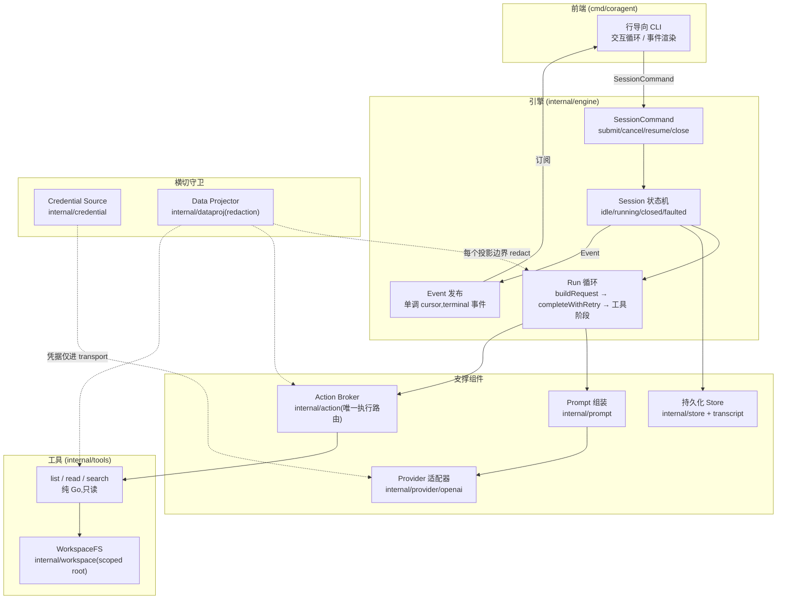
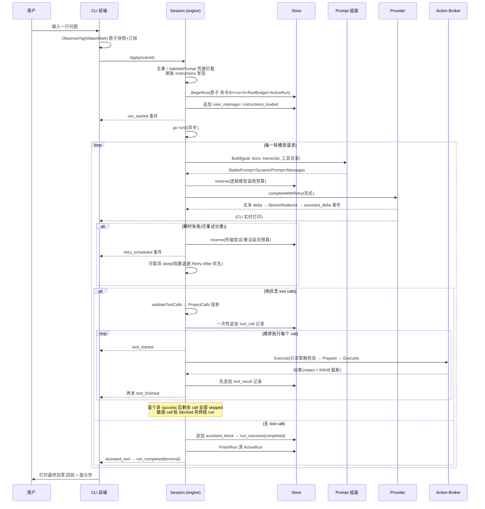
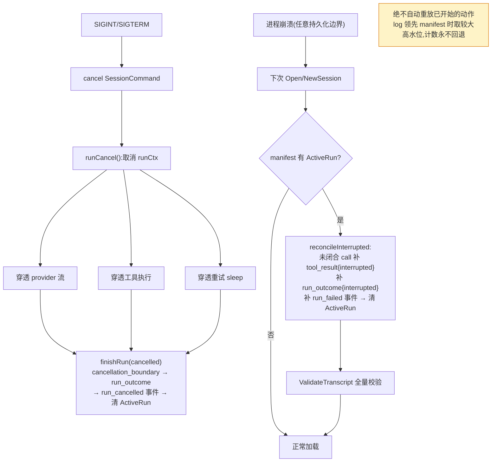
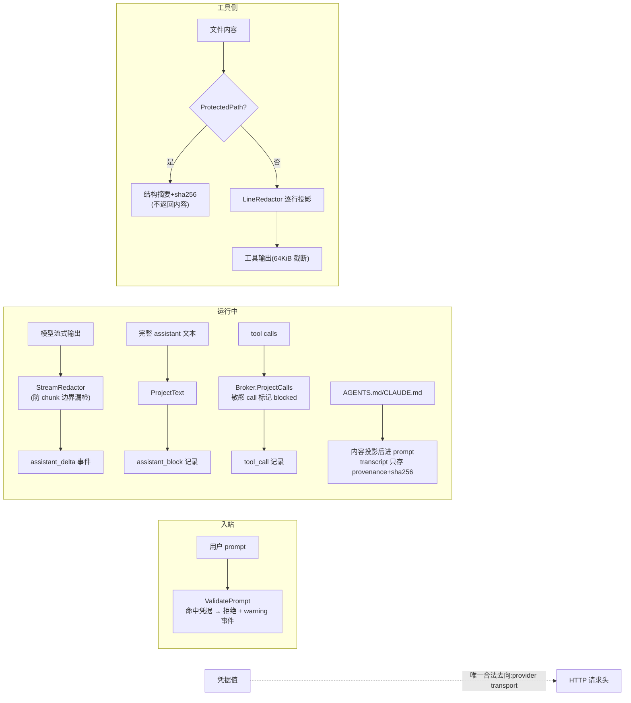

# M1 阶段框架梳理(面向后续开发维护)

> 目的:用图的方式说明 M1(Read-only Repo Companion)交付了什么、运行时如何协作、
> 哪些不变量必须在后续里程碑中保持。权威契约仍是 `docs/product.md`、
> `docs/architecture.md`、`docs/roadmap.md`、`docs/benchmarks.md`;本文是导航图,不替代契约。

## 1. M1 交付了什么

产品结果:开发者在仓库里启动 `coragent` CLI,提出调查问题,agent 用只读工具
(`list` / `read` / `search`)检查真实文件,给出带 `path:start-end` 行号引用的回答;
可取消、可退出进程、可恢复原会话继续对话;瞬时 Provider 故障在持久化预算内有界重试。

已落地的能力(对照 `docs/roadmap.md` M1 Scope):

- 行导向 CLI(`cmd/coragent`):`sessions` / `resume` / `close` / `version` 子命令 + 交互循环
- 内部 Session 状态机:`idle` / `running` / `closed` / `faulted`
- 一套可序列化 SessionCommand 协议(`submit` / `cancel` / `resume` / `close`)
- 一套可序列化 Event 协议(12 种,会话级单调 cursor)
- append-only Transcript(8 种记录,流式 delta 永不落盘)
- 会话创建 / 列表 / 加载 / 恢复 / 关闭,存于 `~/.coragent/sessions/<id>/`
- OpenAI 兼容流式 Provider 适配器 + 脚本化 fake Provider(离线测试)
- 显式 Provider 能力与 context window 配置(绝不从模型名推断)
- 全链路取消:provider 流 → 工具执行 → 重试 sleep
- 分类有界重试(rate_limit / transient / overloaded,指数退避 + `Retry-After` + 抖动)
- 持久化 Run Budget(逻辑模型调用 64 / 传输尝试 96 / 累计重试延迟 10min),重启不重置
- 运行时 prompt 组装(每次请求从零重建,非累积字符串)
- `CLAUDE.md` / `AGENTS.md` 确定性发现与优先级
- 专用凭据来源 + normal / sensitive / runtime-secret 三级数据投影
- workspace 限定的纯 Go 只读工具(不启动任何辅助进程)
- 单一 Action Broker 执行路径(M1 全部为只读,Broker 强制 `EffectRead` 策略)
- 崩溃恢复:中断 run 的 reconciliation,绝不自动重放
- Benchmark 设施:Mercury 冻结 fixture + I01–I04 评分器 + `m1bench` CLI

**当前验收基线**:`artifacts/benchmarks/m1-008` — decision=pass,12 槽位过 10
(I01=2/3, I02=2/3, I03=3/3, I04=3/3),无 safety_fail / infrastructure_fail。
参考 profile:`benchmarks/reference-profile.json`(deepseek-v4-flash 快照,context 131072)。

## 2. 总体架构



依赖方向保持单向:`frontends -> engine -> prompt/provider/action -> store/platform`。
Engine 不 import CLI;Provider 适配器不直接发前端 Event;工具没有任何环境文件系统或网络客户端。

## 3. 包职责速查

| 包 | 职责 | 关键点 |
| --- | --- | --- |
| `cmd/coragent` | CLI 前端 | 只发 SessionCommand、渲染 Event;不拥有 agent 状态 |
| `internal/sessioncommand` | 命令信封 | JSON,严格解码,命令 ID 幂等去重 |
| `internal/event` | 事件信封 | 纯数据(无 channel/回调);cursor 会话级单调、随 store 持久化 |
| `internal/engine` | 状态机 + Run 循环 + 重试 + 预算 + reconciliation | 核心,见第 4–6 节 |
| `internal/prompt` | 指令发现 + 请求组装 | 每次从 transcript 重建;超 context window 显式失败(M1 无压缩) |
| `internal/provider` | 中性接口 + 失败分类 | wire 类型不外泄;`IdentityProvider` 绑定 digest |
| `internal/provider/openai` | SSE 流式适配器 | 明文 HTTP 仅 loopback;协议错误 fail closed |
| `internal/provider/scripted` | fake Provider | 全部离线测试的驱动器(流式/失败/取消) |
| `internal/action` | Action Broker | 唯一执行路由;Prepare/Execute 两段;M1 强制只读 |
| `internal/tools` | list / read / search | 逐行 redact;protected path 只给结构摘要+sha256 |
| `internal/workspace` | scoped root 文件系统 | `os.OpenRoot` + symlink 拒绝 + TOCTOU 防护 + 文件身份 |
| `internal/transcript` | append-only 语义历史 | 记录校验 + 跨记录 pairing 不变量(validate.go) |
| `internal/store` | 会话目录布局与恢复 | manifest 原子替换;jsonl 撕裂写 fail closed;log 是高水位权威 |
| `internal/credential` | 凭据来源 | 值 runtime-only,永不进 prompt/工具/事件/日志/持久状态 |
| `internal/dataproj` | 数据投影 | 9 条凭据检测正则;Line/Stream redactor 防 chunk 边界漏检 |
| `internal/settings` | 配置加载 | 项目级 settings 禁止覆盖 endpoint/api_key_env |
| `internal/benchmark` + `cmd/m1bench` | 基准设施 | 冻结 fixture 校验、黄金评分、三轮报告聚合 |

## 4. 一次用户提问的端到端时序



## 5. 关键子流程

### 5.1 取消与崩溃恢复



### 5.2 数据投影边界(凭据永不越界)



凭据检测器与投影器均带版本号(`credential-detector-v2` / `data-projection-v2`),
manifest 记录 `ProjectionVersion`,演进时可识别旧会话。

## 6. 必须守住的不变量(后续阶段的红线)

这些都有离线测试覆盖(见 `internal/engine/*_test.go`、`store_test.go`、`projector_test.go` 等),
M2+ 改动任何一个都需要对应测试先行:

1. **Tool-call pairing**:每个 tool call 恰好一个终态 tool_result(含 skipped/blocked/interrupted);
   先写记录再发事件;同 run 配对;run 终结时不得有未闭合 call。
2. **Transcript 不可变**:append-only;压缩(未来 M3)不得改写历史;delta 永不落盘。
3. **Event 单调**:cursor 会话级连续递增;每个 run 恰好一个 terminal 事件;
   原子观察(快照+订阅)不丢不重。
4. **预算持久**:重启不能重置模型调用/传输尝试/重试延迟计数(M3 还要扩 compaction/token 维度)。
5. **取消无孤儿**:取消穿透 provider 流、工具、重试;无残留活跃工作。
6. **无未授权副作用**:M1 只读由 Broker 强制;M2 引入写操作后,未批准动作零副作用。
7. **凭据边界**:凭据值只进 provider transport;所有投影边界过 redaction;
   日志不含 prompt/模型内容。
8. **fail closed**:未知/损坏的持久化数据、撕裂写、协议错误 → 停止并报类型化原因,
   绝不重写未知格式;ProviderBinding / WorkspaceIdentity 变化拒绝加载。
9. **单一执行路由**:所有工具(含未来外部/委托工具)只走 Action Broker。
10. **崩溃可恢复**:每个持久化边界前后注入崩溃的矩阵测试必须通过;reconcile 后不重放。

## 7. 面向 M2 的已有接缝

- **Action Broker 的 Prepare/Execute 两段式**已为 M2 的 prepared patch(预览→批准→提交)预留;
  M1 的不可变只读策略(`Effects == [EffectRead]`)是策略注入点,不是硬编码假设。
- **BlockedResult / SkippedResult** 已存在,M2 的 denial / policy block / stale state 沿用同一配对机制。
- **Provider 失败分类**已含 `context_overflow` / `output_limit`,M3 的压缩与续写直接消费。
- **Manifest 的 Authority 字段**(当前 `WorkspaceRead:true`)是 M2 Authority Envelope 的落点。
- **benchmark 的 taskpack** 已为 F01/F02 种子、R01/R02 触发器留好接口;`PermissionScript`
  当前强制只读,M2 放开写/进程权限从这里改。
- **CLI 与 engine 的边界**已经是 M4 TUI 要求的形状(纯 SessionCommand/Event,无运行时内部导入),
  第二个前端不需要改 engine。

## 8. 常用验证命令

```sh
gofmt -w . && go test ./... && go test -race ./...
go build ./cmd/coragent && golangci-lint run ./...

# 基准:跑一轮 / 聚合三轮报告
go run ./cmd/m1bench round --suite <ID> --round <1..3> --endpoint <URL> \
  --api-key-env <NAME> --coragent-bin <PATH> --coragent-commit <SHA>
go run ./cmd/m1bench report --suite <ID>
```
